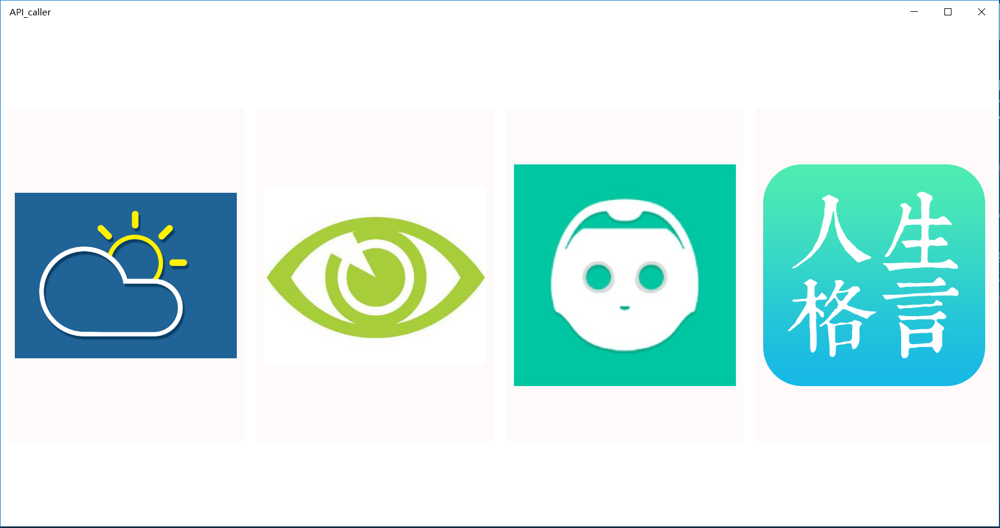
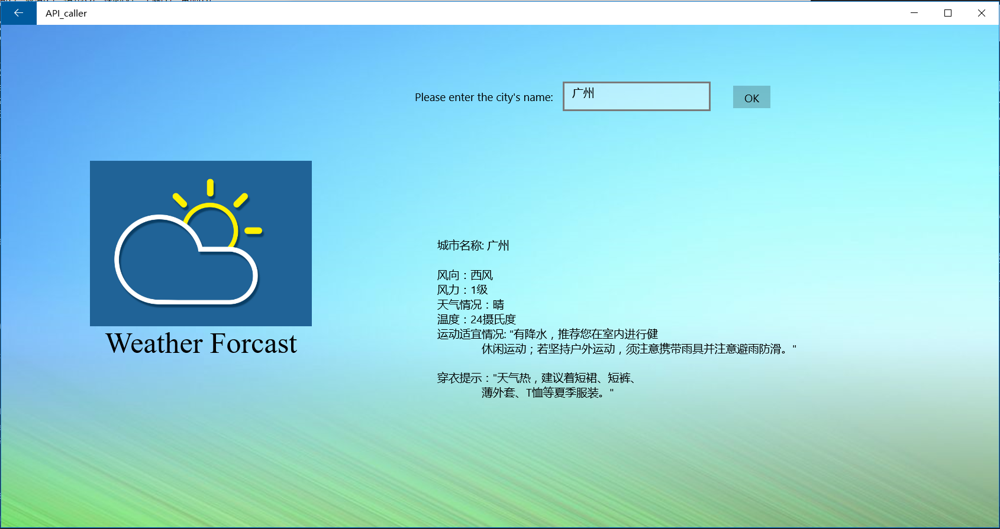
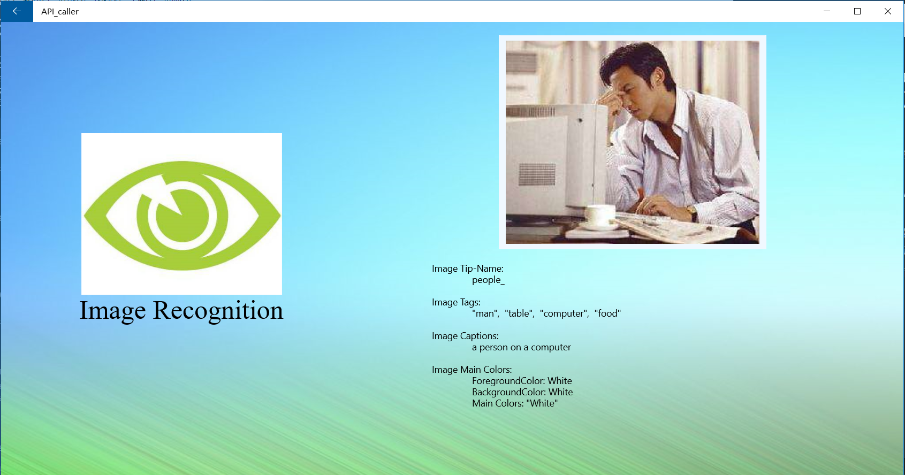
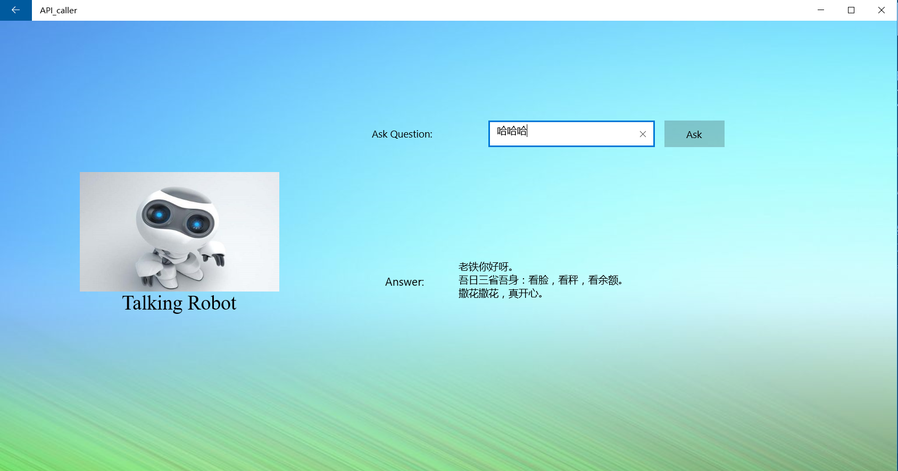
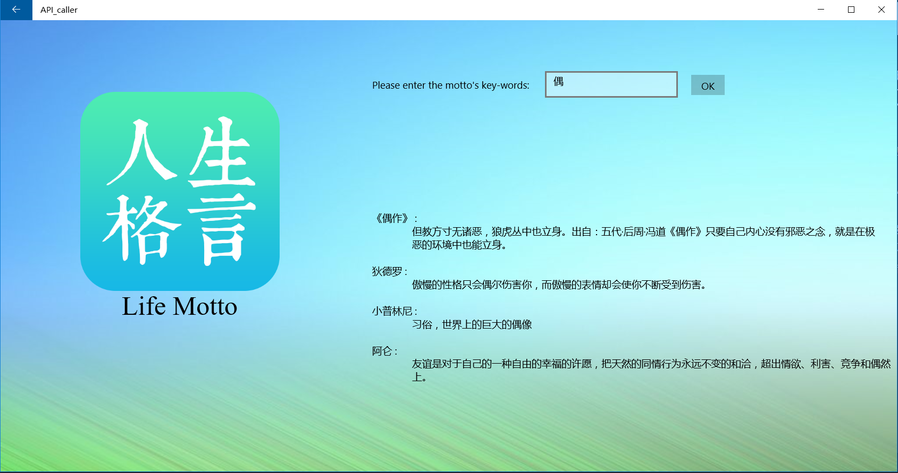
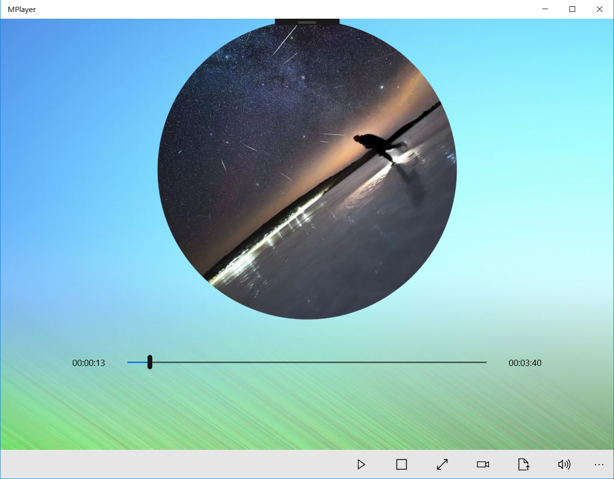
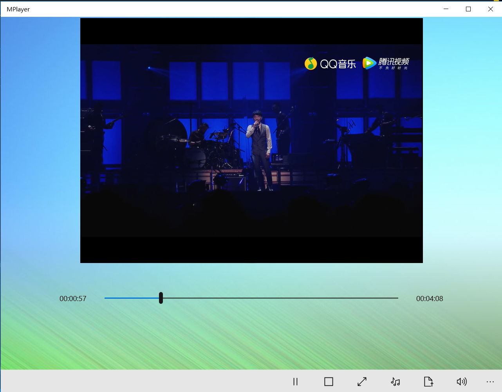
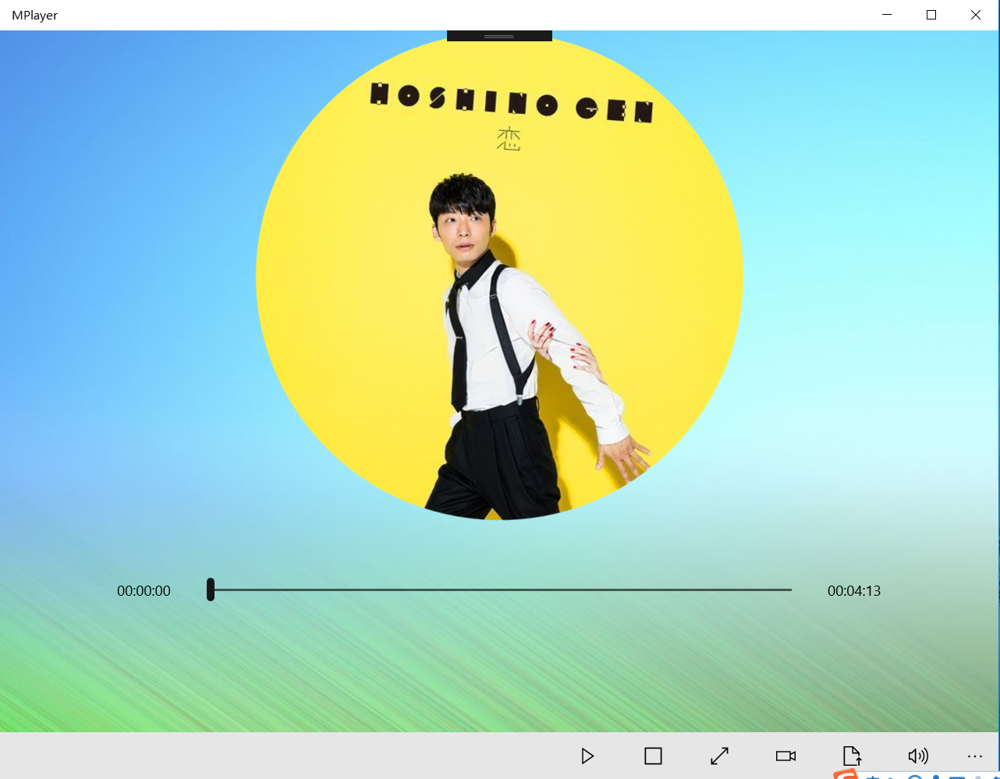
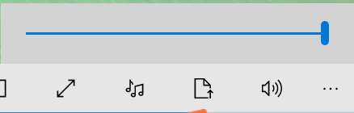
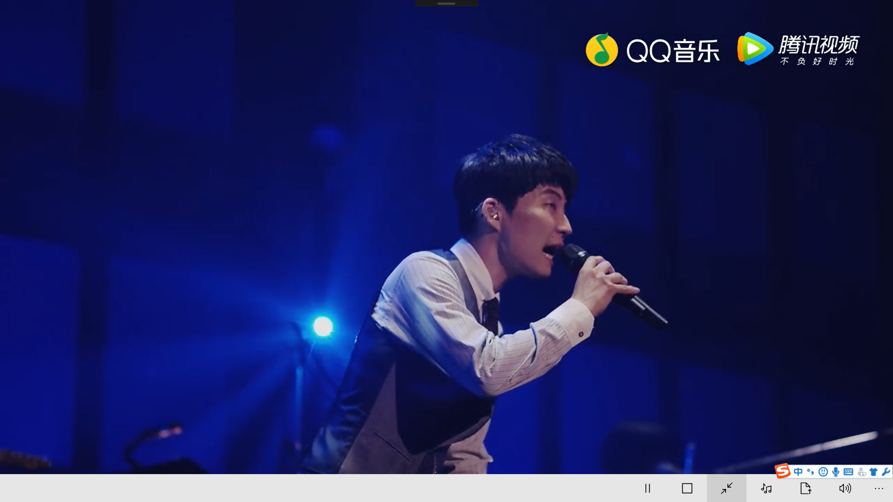

# 现代操作系统应用开发实验报告

### 姓名：陈明亮

### 学号：16340023

### 实验名称： APICaller_and_MediaPlayer

## 一、参考资料

* http://stackoverflow.com

* http://www.avatardata.cn/

* https://docs.microsoft.com/en-us/uwp/api/Windows.Data.Json.JsonObject#Windows_Data_Json_JsonObject_ValueType

* https://blog.csdn.net/

  ​

## 二、实验步骤

1.  #### 第七周任务：实现对网络数据的接受和处理，实现一个支持特定查询方向的Https上的APICaller。

   *  XAML方向：应用主界面上具有进入四个子界面图片按钮，分别对应不同的API，支持自适应效果，图片随着整体的宽度而平稳的移动。

   * C#方向： 分别创建四个子界面对应和处理不同功能的API应用需求，四个功能分别为：查询对应地点的天气，图像具体内容的识别，聊天机器人的对话功能，还有输入关键词查询人生格言。其中，前三种功能是通过JsonObject解析Json格式的返回数据实现的，最后一种功能是使用XmlDocument解析XML数据来获得结果的。在获取对应url的返回数据时，主要使用HttpClient类上的GetStringAsync方法，输入对应URL以及相关的参数，拿到对应格式的返回，再结合本地的解析函数，将结果呈现到XAML界面上。

2.  #### 第八周任务：实现一个音乐/视频播放器，要求实现对应的进度条，以及正确的播放、暂停功能。

   *  XAML方向：根据Page.Resources内的Storyboard，实现360度循环转动的圆形封面，将DoubleAnimation内的目标设为需要转动的图片，加上后台逻辑的判断，实现上传特定歌曲可以读出其专辑封面并显示的功能。同时，为了增加歌曲播放器的特性，增加在界面进度条两侧的播放时长记录，随着歌曲/视频的播放而逐渐改变数据。

   *  C#方向： 根据MediaPlayer类和MediaTimelineController，我们可以将页面上的MediaElement与后台媒体播放器连接起来，实现对播放源的控制和进度条的实现。通过将Slider和TimeLineController的绑定转换器，我们可以实时地控制歌曲播放的进度。应用底层具有播放/暂停，重置，宽屏，播放视频，上传文件以及调节音量的按钮。

     * 其中，播放/暂停和重置操作都是在对MediaPlayer对应的TimeLineController的进度Position的位置，以及运行的状态进行调整。

     * 宽屏则涉及到当前应用ApplicationView的宽屏，以及该播放器元素的IsFullWindow的属性设置为True和False。

     * 上传文件则涉及到对上传选择的文件类型过滤为音频或视频文件类型，并且将其设置为当前播放的源。同时，该应用也将上传时选择音频的动作自动导航到播放音频界面，视频文件则导航到播放视频界面。

     * 音量按钮则主要结合了Slider和音量的转换器，以及浮窗隐藏弹出的机制，实现音量调节。

       ​

## 三、关键步骤截图

1. #### 第七周成果截图：

   * APICaller主界面的截图：

     * 

   * 天气API的实现界面：

     * 

   * 图像识别的实现界面：

     * 

   * 聊天机器人的实现界面：

     * 

   * 人生格言的实现界面：

     * 

       ​

2. #### 第八周成果截图：

   * 音乐播放器初始主界面

     * 

   * 视频播放器界面

     * 

   * 实现专辑封面上传显示

     * 

   * 音量调节大小

     * 

   * 全屏显示

     * 

     ​

## 四、亮点与改进

1. APICaller应用中，实现了四个接口，其中前三个为Json格式解析方法，最后一个为XML解析方法。

   * JSON格式解析方法

     * ```c#
       JsonObject data = JsonValue.Parse(temp).GetObject();
       string answer = data.GetNamedObject("result").GetNamedString("text");
       res.Text += answer + "\n";
       ```

   * XML格式解析方法

     * ```C#
       XmlDocument xml = new XmlDocument();
       xml.LoadXml(result);
       motto.Text = getMottoMessage(xml);
       ```

2. MediaPlayer应用中，实现了图片转动的功能。

   * XAML部分代码

     * ```XAML
       <Page.Resources>
               <Storyboard x:Name="board" RepeatBehavior="Forever">
                   <DoubleAnimation Duration="0:0:15" To="360" 
                             Storyboard.TargetName="BackImage"
                             Storyboard.TargetProperty="(UIElement.RenderTransform)(CompositeTransform.Rotation)"/>
               </Storyboard>
       </Page.Resources>
       ```

3. 支持手动选择本地的音乐，视频进行播放，并且将其封面更换为对应音乐的专辑封面。

   * 选择上传文件的C#代码

   ```C#
   if (result != null)
   {
     using (IRandomAccessStream stream = await result.OpenAsync(FileAccessMode.Read)){
              mplayer.Source = MediaSource.CreateFromStream(stream, result.FileType);
              if (result.FileType == ".mp4")
              {
                   videoPlayer.SetMediaPlayer(mplayer);
                   videoPlayer.Visibility = Visibility.Visible;
                   video.Icon = new SymbolIcon(Symbol.Audio);
                   video.Name = "audio";
               }
               else
               {
                    videoPlayer.Visibility = Visibility.Collapsed;
                    video.Icon = new SymbolIcon(Symbol.Video);
                    video.Name = "video";
                }
             }
   }
   ```

   * 将专辑封面更换功能

   ```C#
       var thumb = await result.GetScaledImageAsThumbnailAsync(Windows.Storage.
       FileProperties.ThumbnailMode.MusicView, 700);
       BitmapDecoder de = await BitmapDecoder.CreateAsync(thumb);
       WriteableBitmap wbit = new WriteableBitmap((int)de.PixelWidth, (int)de.PixelHeight);
       wbit.SetSource(thumb);
       AudioImg.ImageSource = wbit;
   ```

4. 支持XAML标签元素上的Drop函数，即可以实现拖动文件到应用上，即完成上传文件的功能

	* ```C#
     e.AcceptedOperation = DataPackageOperation.Copy;
     if (e.DataView.Contains(StandardDataFormats.StorageItems)){
             var items = await e.DataView.GetStorageItemsAsync();
             items = items.OfType<StorageFile>().Where(s => s.FileType.Equals(".mp3") || 					s.FileType.Equals(".mp4") || s.FileType.Equals(".wma") 
                                         || s.FileType.Equals(".wmv")).ToList() as 													IReadOnlyList<IStorageItem>;
             foreach(var item in items)
             {
                  StorageFile file = item as StorageFile;
                  upload_event(file);
                  on_reset();
                  startTime.Text = "00:00:00";
                  endTime.Text = "00:00:00";
             }
     }
     ```


## 五、遇到的问题

* 反思与总结
  1. 总体上来看，最后一次的UWP作业也算是结束了，并且总体上也不是太难，第七周的任务是调用网络API接口的应用，相对来说是比较简单的，只需要对HttpClient类等熟练掌握方法，以及对接收到的文件做解析就可以得到正确的结果。相比之下，其他同学大多数都只做了一个功能，而我为了更加好交代，做了四个功能，实际上在寻找API供应商的时候还有一些挫折，比如图像识别的接口，一开始使用了百度的，但发现其实不是太好用，于是转向了微软的接口，发现信息比较具体，而且识别的时间相对较短。
  2. 对于媒体播放器的实现来说，一开始还是卡在进度条和播放进程的关系上，并且还曾经遇到了不能很好地在视频界面和音乐界面来回切换的蜜汁bug。但经过不断地询问，最终才发现是播放源在更换之后，不能回到之前Pause的位置，所以必须重新开始的问题，也算是小问题，但不仔细观察也不能好好体会到各项之间的关系。
  3. 希望能够再接再厉，在之后的Cocos-2d的学习中更加努力吧。
