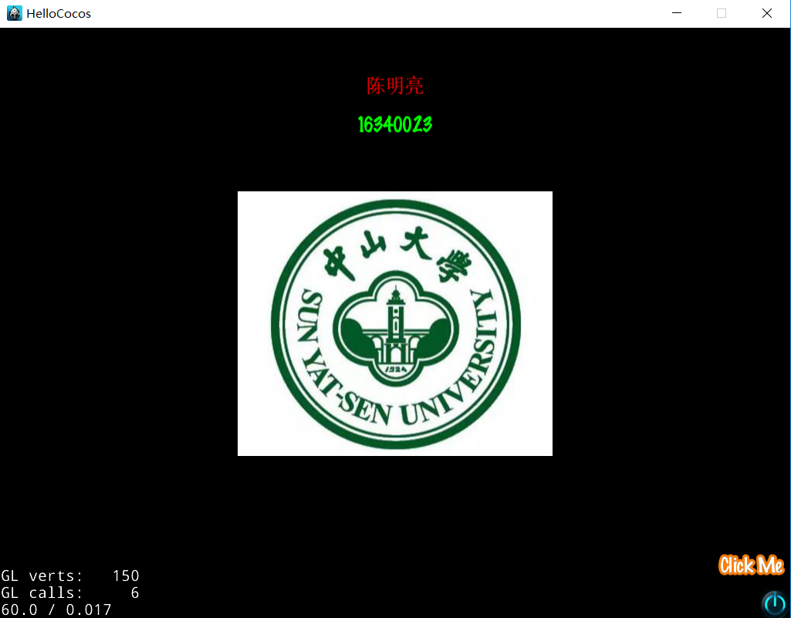
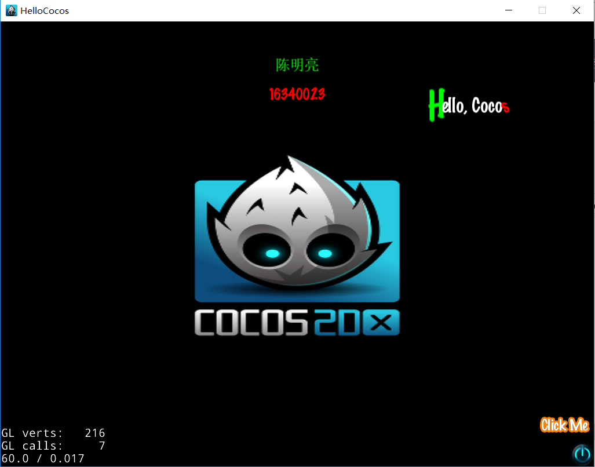
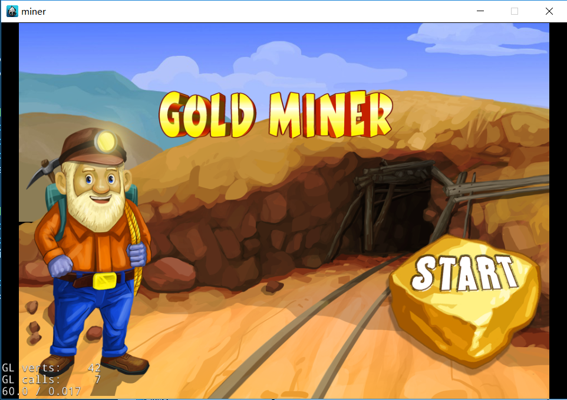
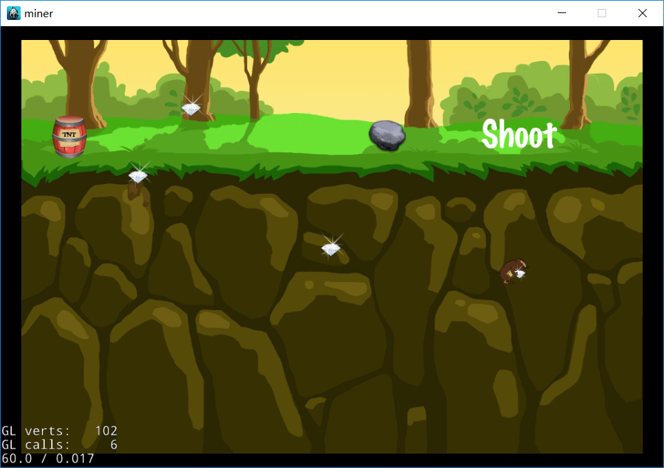
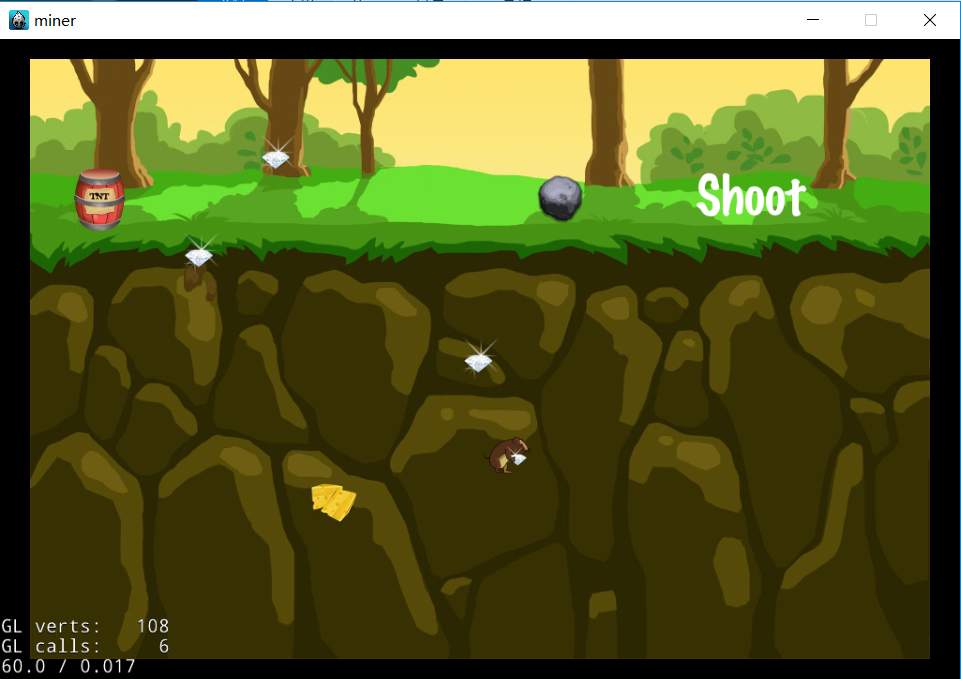
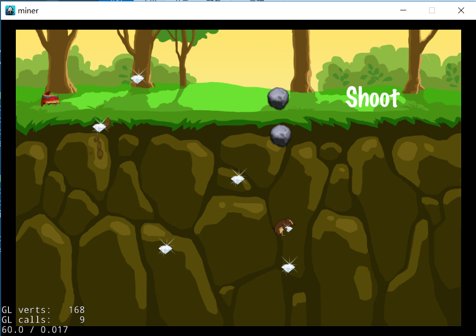
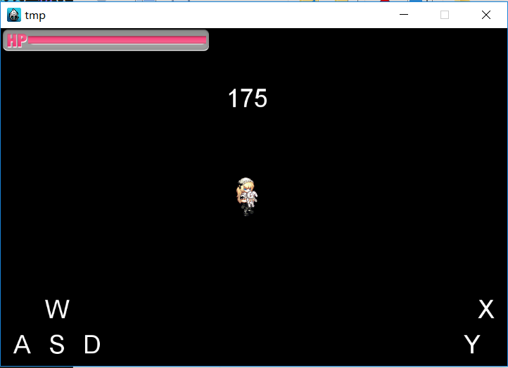
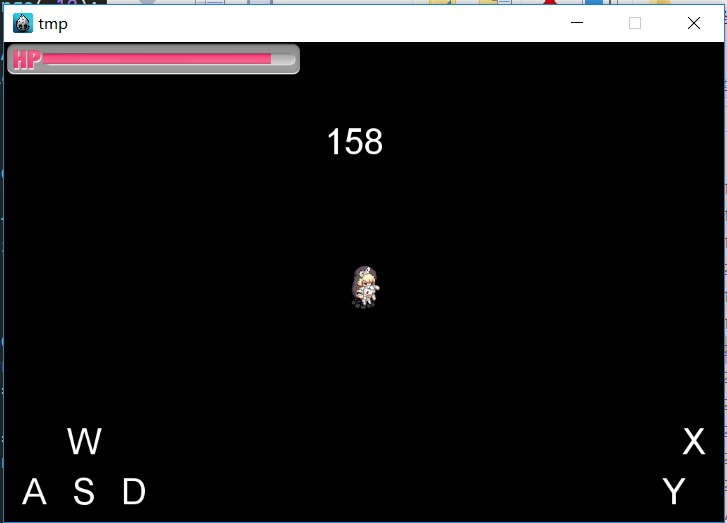
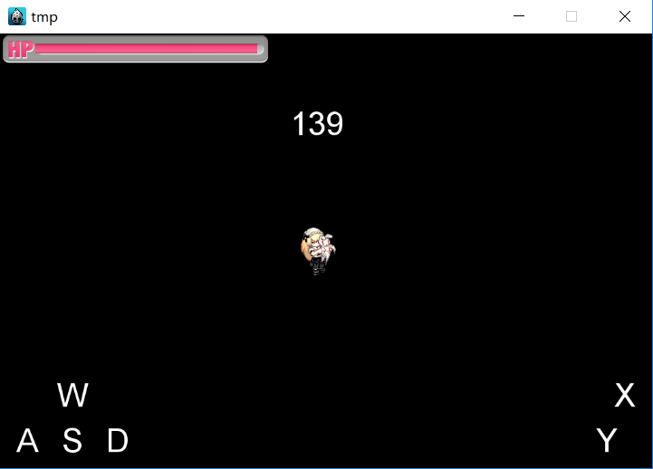
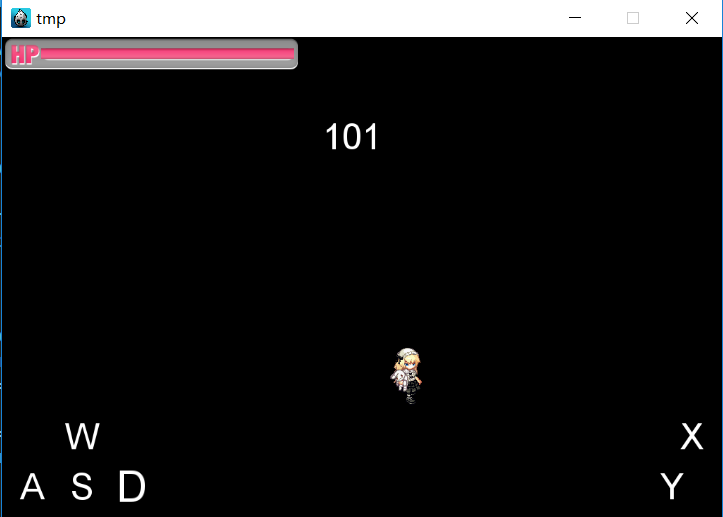

# 现代操作系统应用开发实验报告

### 姓名：陈明亮

### 学号：16340023

### 实验名称：Cocos2dx-Games

## 一、参考资料

* http://www.cocos.com/docs/native/ 
* http://www.cocos2d-x.org/docs/api-ref/
* https://blog.csdn.net/


## 二、实验步骤

1. ##### 第九周任务：在电脑上安装cocos2d-x，并配置好程序运行环境，并使用VS2017创建运行自己的第一个HelloWorld项目。

   *  需求功能1：显示自己的学号姓名。

     ​	对于此功能的实现，我们只需要定义两个Label类型实例，并将所需的显示内容，以及对应的字体，以及大小传入构造函数即可。但实际上cocos2dx内部对中文的支持不是太好，所以我们需要将自己的名字，存储在xml文件内部，并在使用时创建Dictionary实例读取中文，需要注意的是，有一些字体也是不支持中文显示的，有时候只会以方框出现，所以我们需要选择例如微软雅黑，或者Arial等支持中文显示的字体。创建之后再将两者添加进当前Scene中，调用addChild方法。

     ​

   *  需求功能2：显示自定义的图片。

     ​	显示图片，只需要创建Sprite变量，并将对应图片的存储路径传给构造函数即可。与任何创建之后的实例相同，如果需要在界面上显示，则需要调用setPosition函数，定义位置，再使用this->addChild()，传入需要添加的变量，实现对当前Scene的Child添加。

     ​

   *  加分功能：添加MenuItem，实现点击触发事件。

     ​	此处本人所定义的触发事件为：点击Click Me按钮，实现图片内容的更换，以及学号姓名的颜色交换，还有Hello，Cocos语句的浮现和隐藏。关于点击按钮触发时间的实现，实际上只需要定义MenuItemLabel（显示文字的MenuItem），并使用CC_CALLBACK_X系列，设置对应的回调函数即可。此外MenuItem的显示需要依赖于Menu的创建和添加，所以我们需要定义以已经创建好的MenuItem为参数的Menu，并将其添加入当前Scene中。

     ​

2. ##### 第十周任务： 设计并实现新版矿工游戏，实现主界面和游戏界面的跳转，以及主体的游戏逻辑设计。

   * 需求功能1：主界面场景完善，以及两个界面之间过渡跳转。

     ​	主界面只需要添加一个主题Label，以及对应的石头图片，和一个Start的MenuItem即可，对应的功能为实现从当前Scene转到GameScene，并添加过渡效果，具体的实现为创建一个GameScene的实例，进而创建更换动画（此处使用了TransitionFade效果），并调用导演类的更换函数，实现场景切换。

     ​

   * 需求功能2：游戏界面的布局。

     ​	基本的游戏界面需要包含背景图片，以及石头，老鼠，和Shoot的点击标记。此处石头和老鼠的创建均采用了加载动画的方式创建，Shoot功能的实现即一般的MenuItem的回调函数加载逻辑。

     ​

   * 需求功能3：游戏主体逻辑实现。

     ​	游戏总体上须实现：点击屏幕留下奶酪，老鼠移动至奶酪；点击Shoot，老鼠随机移动，留下钻石。首先，对于点击屏幕的功能实现，我们需要实现onTouchBegan函数，获取点击位置，并且在对应位置留下奶酪。其次，我们需要老鼠移动到对应的奶酪位置，这就需要老鼠精灵加载MoveTo动画，从原始位置移动到奶酪位置。此外，奶酪在老鼠到达后的一段时间内消失，这就需要对老鼠执行的Action进行Sequence序列化，将奶酪消失的动作放置到MoveTo动作的后一段时间内。关于点击Shoot发射石头打老鼠的功能，我们只需要新建一个石头执行MoveTo动画，以及钻石的新建，随机数的合法范围产生，使得老鼠能够随机移动并不出界。同样地，我们也有石头到达钻石位置一段时间后消失，采用的也是序列化动作方法。

     ​

   * 加分功能：

     ​	添加石头，TNT，以及泥土动画。利用level-sheet内部的动画，我们将石头，TNT，泥土动画的每一帧放到Cache中，并且在创建游戏时拿出，相应地生成对应动画元素。

     ​

3. ##### 第十一周任务：实现横版移动游戏，控制角色的动画行为，以及合法移动，调度器的倒计时实现，血条的增减。

   * 需求功能1：创建wasd虚拟按钮控制角色的移动，加载对应帧动画。

     ​	首先，创建wasd四个分别对应的MenuItemLabel，并定义对应的回调函数都为move，采用CC_CALLBACK_0方法，定义回调函数拿到的四个不同参数，从而确定移动方向。此外，声明Vector变量，将运动动画逐帧放入Vector容器中。为了实现player的移动，我们仍需要运动动作MoveTo，为了实现运动和动画行为的同时播放，我们需要利用Spawn创建一个合成动画，使player边移动边执行运动动画。

     ​

   * 需求功能2：创建xy虚拟按钮，播放对应动画，实现血条的增减。

     ​	创建xy两个右侧的MenuItemLabel，分别定义不同的回调函数（x按钮为playDead，y按钮为playAttack），同样地将所需要执行的帧动画按顺序放入Vector容器中，使用Animation函数创建对应动画并执行。为了使X,Y的动画不能同时播放，我们此处定义：X,Y动画在播放对应动画时，会停止一切之前的Action，我们使用stopAllActions方法来实现此效果。此外，为了实现血条的增减，我们在对应的回调函数中实现对血条progressTimer的percentage的修改。

     ​

   * 需求功能3：创建调度器，实现倒计时。

     ​	调度器的创建只需要重写update函数，在init函数中添加自定义schedule函数参数（如调度函数，调度时间间隔为1秒）即可。在update函数中，我们拿到对应的时间显示Label内容，将string通过atoi转int，实现减一，再使用toString函数转换即可。

     ​

   * 加分功能：实现血条动画。

     ​	此处的血条动画采用的是ProgressTo动画实现的，首先拿到对应的ProgressTimer，然后定义动画时间为0.5f，根据血条的增减（间隔为10），然后执行该动画即可。

     ​

## 三、关键步骤截图

1. ##### 第九周成果截图：

   * HelloCocos的主界面

     

   * 点击Click Me之后的界面，实现图片更换，添加Hello，Cocos语句（实际上该语句有实现动画）

     


2. ##### 第十周成果截图：

   * 黄金矿工主界面

     

   * 游戏初始界面，可以看到左侧TNT，以及泥土精灵。

     

   * 游戏点击Shoot数次之后的界面

     

   * 老鼠移动至奶酪界面

     

   * 石头发射到老鼠界面

     


3. ##### 第十一周成果截图：

   * 游戏主界面

     

   * 执行X按钮动画（Dead）中的界面，血条减少

     

   * 执行Y按钮动画（Attack）中的界面，血条增加

     

   * 执行移动按钮D中的界面

     

     ​


## 四、亮点与改进

 1. HelloCocos项目中，设置了姓名，学号以及MenuItem的文字样式设置，添加了ClickMe按钮的切换事件，并添加了动画Label，实现对其的显示隐藏。

    * 文字样式设置

      ```c#
      auto clickLabel = Label::createWithTTF("Click Me", "fonts/Marker Felt.ttf", 25);
      clickLabel->enableOutline(Color4B::ORANGE, 3);
      auto labelOne = CCLabelTTF::create(name, "msyh", 25);
      auto labelTwo = Label::create(id, "fonts/Marker Felt.ttf", 25);

      labelOne->setColor(Color3B::RED);
      labelTwo->setColor(Color3B::GREEN);
      ```

    * MenuItem触发事件

      ```c#
      void HelloWorld::menuClickCallback(Ref* pSender) {
      	auto allNodes = CCDirector::sharedDirector()->getRunningScene();
      	findImageSprite(allNodes, isSYSU);
      }

      void findImageSprite(Scene* root, bool& isImg) {
      	Sprite* node = (Sprite*)root->getChildByTag(0);
      	if (isImg) {
      		Texture2D* newImg = TextureCache::sharedTextureCache()
      											->addImage("img/HelloWorld.png");
      		node->setTexture(newImg);
      		isImg = false;
      		((Label*)root->getChildByTag(3))->setVisible(true);
      	}
      	else {
      		Texture2D* newImg = TextureCache::sharedTextureCache()->addImage("img/zsdx.jpg");
      		node->setTexture(newImg);
      		isImg = true;
      		((Label*)root->getChildByTag(3))->setVisible(false);
      	}
      	exchangeColors(root->getChildByTag(1), root->getChildByTag(2));
      }
      ```


2. GoldMiner项目中，增加了对level-sheet中的动画的额外添加

   * GameScene内的动画调用

     ```c#
     //Stone and Mouse, as well as tnt
     auto stone = Sprite::createWithSpriteFrameName("stone-0.png");
     auto mouse = Sprite::createWithSpriteFrameName("gem-mouse-0.png");
     auto TNT = Sprite::createWithSpriteFrameName("TNT.png");
     auto soil = Sprite::createWithSpriteFrameName("soil-0.png");

      //Animation definitions
     Animate* mouseAnimate = Animate::create(AnimationCache::getInstance()
     									->getAnimation("mouseAnimation"));
     Animate* stoneAnimate = Animate::create(AnimationCache::getInstance()
     									->getAnimation("stoneAnimation"));
     Animate* tntAnimation = Animate::create(AnimationCache::getInstance()
     									->getAnimation("tntAnimation"));
     Animate* soilAnimation = Animate::create(AnimationCache::getInstance()
     									->getAnimation("soilAnimation"));

     mouse->runAction(RepeatForever::create(mouseAnimate));
     stone->runAction(RepeatForever::create(stoneAnimate));
     TNT->runAction(RepeatForever::create(tntAnimation));
     soil->runAction(RepeatForever::create(soilAnimation));
     ```
     

3. FrameGame项目中，实现对血条动画的实现


   * ```c#
     void HelloWorld::bloodChange(int num) {
     	auto root = CCDirector::sharedDirector()->getRunningScene();
     	auto pT = (ProgressTimer*)root->getChildByName("pT");
     	Sprite* sp0 = (Sprite*)(root->getChildByName("sp0"));
     	
     	auto action = ProgressTo::create(0.5f, pT->getPercentage() + num);
     	pT->runAction(Repeat::create(action, 1));
     }
     ```

     ​

## 五、实验心得

1. 本次实验是第一次的Cocos2dx三个项目，相对来说比较简单，毕竟使用的语言是C++，在大一下学期的C++程序设计中已经掌握地很熟练了，再加上可以从Cocos官网查看官方文档，所以学习过程还是比较轻松，在需要实现相应的功能时，只需要查看相应类的功能，以及实现的方法，就可以知道对应的代码编写逻辑。

   ​

2. 在实验中也有遇到一些问题，第一个遇到的问题即是cocos2dx的环境问题，这个问题也困扰着身边的同学，错误提示为找不到对应的库文件（如stdlib.h,stdio.h等），后来通过csdn博客的提示，才找到原因是SDK版本过高，16版本没有支持一些基础库，于是才在项目属性内把14版本的各项文件路径添加上去，问题得以解决。第二个问题则是关于cocos内部如何在另一个函数内，拿到并操作init内定义的各项精灵和Label，通过查找相关资料，得知我们可以设置Name和Tag，然后根据导演类的获取当前Scene函数，进而getChild通过Name或Tag，拿到对应的元素，进行相应操作。

   ​

3. 做为Cocos2d-x学习过程的第一个实验，实际上是在为我们之后的学习奠定基础，希望在之后难度更高的游戏编写过程中能够学习更多，对cocos游戏的编写和总体设计上更加熟练。