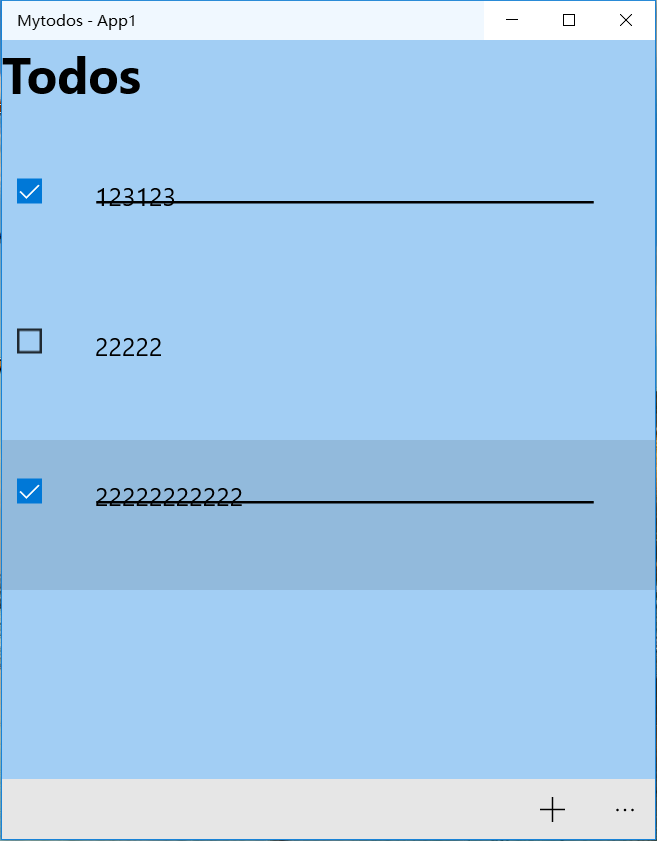
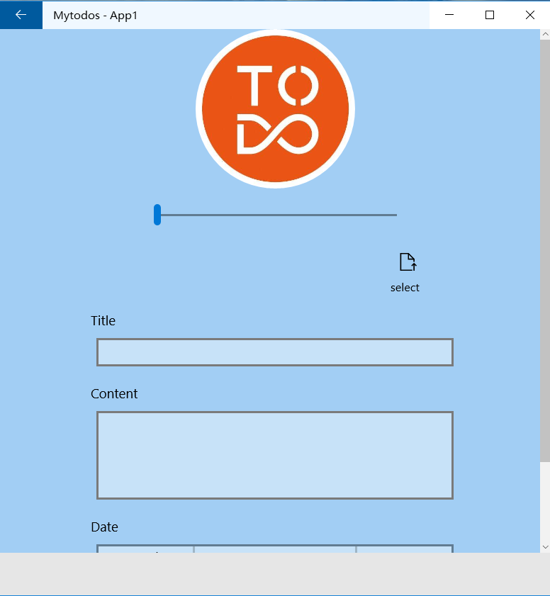
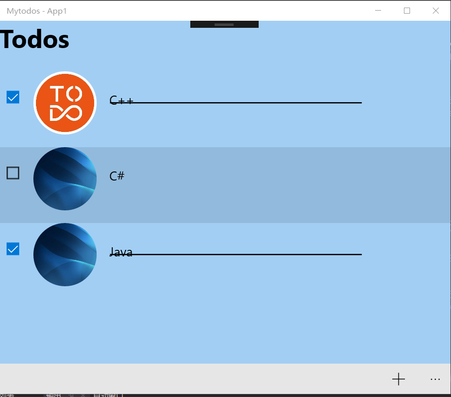
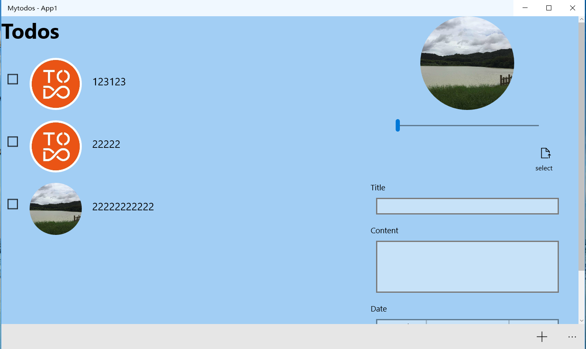
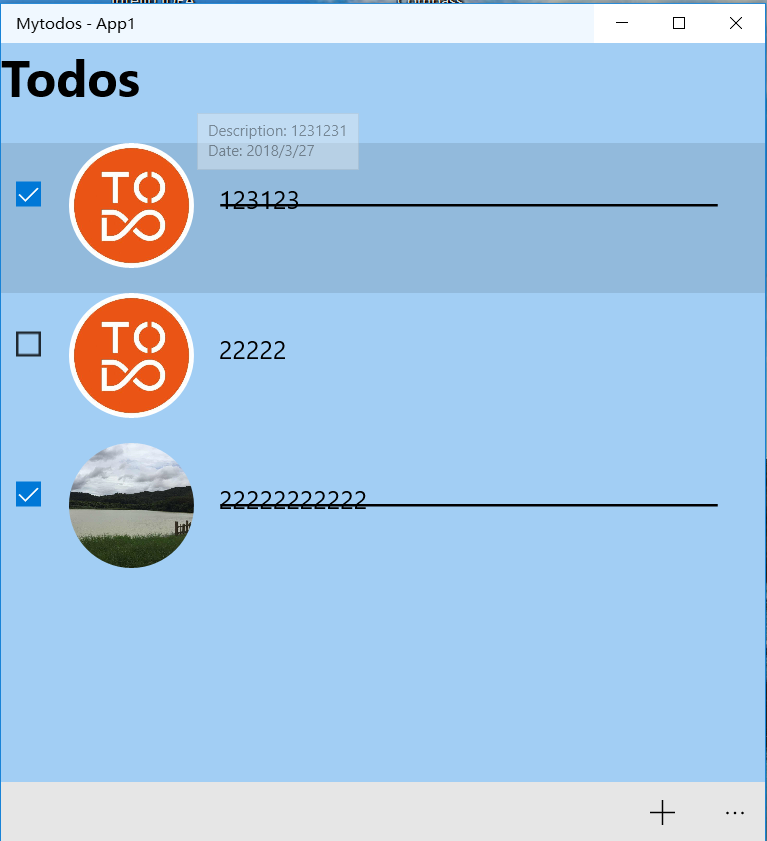

# 现代操作系统应用开发实验报告

### 姓名：陈明亮
### 学号：16340023
### 实验名称：My Todo_list

## 一、参考资料
* https://stackoverflow.com/ 
* https://developer.microsoft.com/zh-cn/windows/apps/
* https://blog.csdn.net/
* https://docs.microsoft.com/zh-cn/windows/uwp/
* https://msdn.microsoft.com/zh-cn/library/

## 二、实验步骤
1. * XAML方向：
    首先，构建了该项目的第一个XAML界面 --- MainPage.xaml，掌握在Visual Studio的界面编辑器下编辑XAML代码的能力，大致了解工具栏中的各种控件，并在界面上添加CheckBox和Line，掌握Margin，Click，Visibility的属性的运用，并结合视图调整控件的大概位置。
    然后，开始编辑NextPage.xaml界面，了解到TextBlock，TextBox和DatePicker，ContentDialog和Button控件,并布局了新界面。

   * C#方向：（在掌握了C++的基础上）
    第一周首先完成了简单的数据绑定，先是使用x:Name属性成功在后台拿到了xaml界面对应的控件，并加以设置属性，使其完成简单的逻辑。在Create时，实现了Button对应的内容和日期判断函数，运用了Date类的一些属性，并动态生成ContentDialog显示。

2. * XAML方向：
    第二周主界面加入了Image和AppBarButton控件，通过设置Source属性来使得Image显示对应的图片，也在Page的底端加上了Command，实现底部跳转按钮栏，以及整体右侧的滚动条ScrollViewer。最重要的是，学习了Grid和StackPanel两个布局控件，使得每个显示行和列被规范起来，整体界面整齐美观。

   * C#方向：
    主要是两个界面间的Navigation。首先对于主界面，我们使用Frame类自带的Navigate导航到NextPage，但为防止界面堆栈的多次新建，我们在NextPage返回到主界面时使用GoBack函数，来回到堆栈中的前一个界面。为达到这个目的，我们须为rootFrame注册BackRequest委托，并且在可GoBack时显示返回标题栏按钮。

3. * XAML方向：
    第三周主界面须实现Adaptive UI，在窗口宽度改变时提供不同的试图，新加入VisualState控件，实现在不同State中的跳转。此外，为配合后台C#的数据绑定，须加入ListView控件，使用x:Bind关键字绑定后台数据与前台显示内容。

   * C#方向：
    本周的C#部分是整个TodoList应用的最核心部分。首先，在MVVM设计模式下，分别创建了用于表示Item的类，收入Model文件夹，ViewModel文件夹则实现了这个Item的可视化集合的另一个视图类。在两个界面的C#文件中，则需要在主界面新建并维护该视图类的实例并作为Item的总集合，提供删除，增加，修改的函数。


## 三、关键步骤截图
* 第一、二周成果：MainPage和NextPage

    
    

* 第三周改进：
    MainPage (宽度适中)
    
    

    (大宽度界面)
    
    

    (Bonus项，添加鼠标悬停显示详情)
    
    


## 四、亮点与改进
1.  XAML方向：将图片显示改为圆形，更加美观。

    C#方向：增加本地上传图片的功能，使用户能够选择自己想要的图片。

    ``` 
    private async void img_click(object sender, RoutedEventArgs e)
        {
            var srcImage = new BitmapImage();
            FileOpenPicker file = new FileOpenPicker();
            file.FileTypeFilter.Add(".jpg");
            file.FileTypeFilter.Add(".png");
            file.FileTypeFilter.Add(".jpeg");
            Windows.Storage.StorageFile result = await file.PickSingleFileAsync();
            if (result != null)
            {
                using (IRandomAccessStream stream = await result.OpenAsync(FileAccessMode.Read))
                {
                    await srcImage.SetSourceAsync(stream);
                    todo_img.ImageSource = srcImage;
                }
            }
        } 
    ```

2.  XAML方向：增加Slider调节图片的大小。

    C#方向：使用户上传的图片能够自定义尺寸，增加属性设置。

    ```
    private void Slider_ValueChanged(object sender, RangeBaseValueChangedEventArgs e)
        {
            Slider sli = sender as Slider;
            if (sli != null)
            {
                eimg.Height = 180 + sli.Value * 0.3;
                eimg.Width = 180 + sli.Value * 0.3;
            }
        }
    ```

3.  XAML方向：增加详情提示框，当鼠标悬停在某个Item上时显示该    Item的Desciption和Date。

    C#方向：采用动态绑定ToolTip控件，使用ToolTipManager为每个新生成的Item绑定鼠标PointEntered事件显示详情框。

    ```
    private void list_PointerEntered(object sender, PointerRoutedEventArgs e)
        {
            TextBlock text = (TextBlock)sender;
            Item find_item = MainViewModel.store.Select_with_title(text.Text);
            string time = find_item.date.Year.ToString() + '/' 
                            + find_item.date.Month.ToString() + '/' 
                                + find_item.date.Day.ToString();
            string content = "Description: " + find_item.content + "\nDate: " + time;
            ToolTip tip = new ToolTip();
            tip.Content = content;
            ToolTipService.SetToolTip(text, tip);
        }
    ```

## 五、遇到的问题
1. 动态绑定的数据更新问题。在一开始的设计中，由于不知道x:Bind的Mode工作机制，以及INotifyPropertyChanged的相关类函数的实现，导致ListView中的Item无法实时更新更改内容，以及Line的显示，后来让Item类，和主界面类继承INotifyPropertyChanged并实现接口之后才得以解决问题。

2. XAML下无法为ListView中的项设置x:Name属性问题，导致在小窗口状态下图片的消失无法通过XAML中VisualState的属性设置实现，遂转向后台监视窗口宽度的改变，来绑定到每个Item中Image的Visibility。

## 六、反思与总结
* 反思：UWP应用开发的过程中需要很多耐心，由于对XAML控件属性，以及各种C#类的不了解，导致在设计需求的路上走了很多弯路，也是属于边打代码边搜博客，msdn的类型。

* 本次项目作为现操课的第一次作业，完成之后也不免感到安慰，但打下来感觉自己在UWP各种控件和C#语言了解了不少，希望在接下来的日子里对这方面的知识更加熟练掌握。