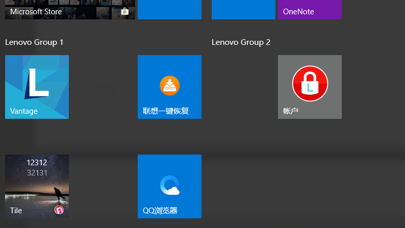
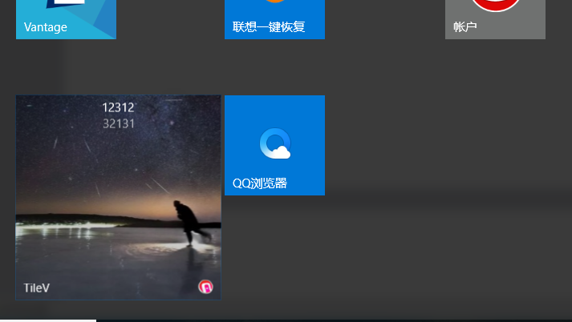
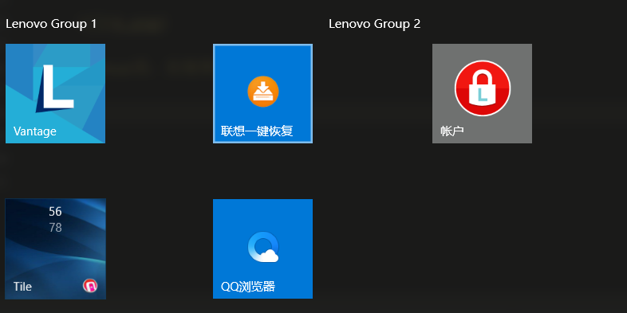
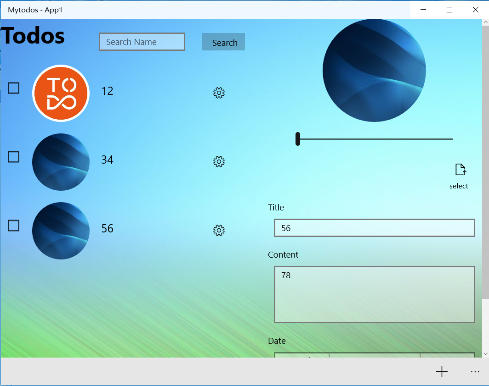
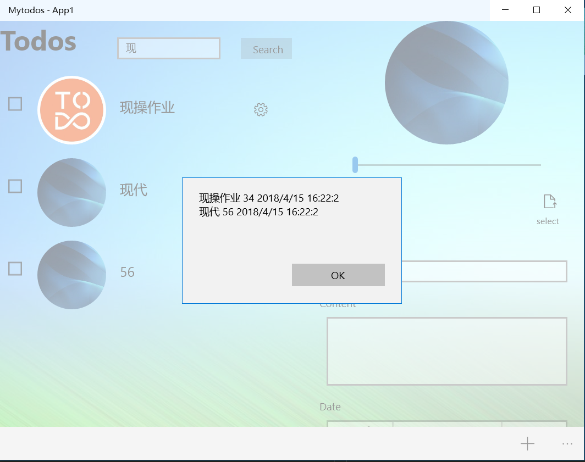

# 现代操作系统应用开发实验报告

### 姓名：陈明亮
### 学号：16340023
### 实验名称：My_TodoList2

## 一、参考资料
* https://stackoverflow.com/
* https://docs.microsoft.com/zh-cn/windows/uwp/data-access/sqlite-databases
* https://docs.microsoft.com/zh-cn/windows/uwp/design/shell/tiles-and-notifications/create-adaptive-tiles
* https://blog.csdn.net/
* https://docs.microsoft.com/zh-cn/windows/uwp/launch-resume/app-lifecycle

## 二、实验步骤
1. ### 第四周任务：挂起并关闭，保留挂起前的输入数据。
    * #### XAML方向：该项任务对于XAML界面没有明显的要求，故着重讲C#方向的实验过程，此处不做赘述。

    * #### C#方向：
        1. 需求中的挂起并关闭，再次开启导航到上次打开的界面功能体现在App.xaml.cs的OnSupending函数和OnLaunched函数中，我们需要将该项NavigationState存储在Application.Current.LocalSetting.Value中，并在挂起执行OnSuspending时将导航页状态存储到Value中，同理在再次打开执行OnLaunched函数时读取上次挂起时保存的状态。

        2. 具体对于每个界面的输入数据的存储保留，则体现在MainPage.xaml.cs和NextPage.xaml.cs的OnNavigatedTo函数和OnNavigatedFrom函数中。
            * OnNavigatedTo函数是在其他界面导航到当前界面时执行的函数，所以为了保留数据，我们需要在此项函数中读取上次保存的各项数据，首先判断进入该XAML界面NavigationMode是否为NewMode，即不是挂起之后重新打开，是的话则不需要读取数据，并且将旧数据项清除，反之则使用ApplicationDataCompositeValue类型变量，从LocalSetting的Value中读取数据项并重新装载到页面中。

            * OnNavigatedFrom函数是在当前界面离开时执行的函数，所以我们需在离开之前将页面上的各项重要信息保留在LocalSetting的Value中。首先判断是否为挂起操作，可以通过App类中设置issuspend变量，并在挂起函数中改变值设置，若为挂起操作，则需要将各项数据配置在Value中。
        
        3. 挂起并关闭的过程中需要将页面间导航传递的参数序列化，所以此时如果我们是通过MainPage按下某项Item进入到NextPage并采用传递整个Item的方法，那么VS将会报错，因为C#不能对基本类型之外的变量类型进行序列化。此时，我们可以采用两种方法进行debug：
            * 首先就是最直接的方法 ---- 将Item类型换成原生类型(如int类型的id)，再使用该具有唯一标识的key去ViewModel中回询读出所需数据。

            * 其次是将自定义数据类型进行序列化，可以看到UWP支持的序列化方法很少，基本上不支持Formatter的自定义，但我们仍可以使用System.Runtime.Serialization.Json库，将自己定义的类转为JSON格式传过去，然后NextPage在反序列化，将JSON反格式化为Item类型。具体代码见下文：

                * MainPage到NextPage的JSON格式序列化过程
                ```
                DataContractJsonSerializer dcjs = new DataContractJsonSerializer(typeof(Item));
                MemoryStream ms = new MemoryStream();
                dcjs.WriteObject(ms, click_item);
                ms.Position = 0;
                StreamReader srm = new StreamReader(ms, Encoding.UTF8);
                string json_pass = srm.ReadToEnd()；
                Frame.Navigate(typeof(NextPage), json_pass);
                ```
                * NextPage接收到序列化JSON参数后的反序列过程
                ```
                string json_pass = e.Parameter.ToString();
                var ms = new MemoryStream(Encoding.Unicode.GetBytes(json_pass));
                DataContractJsonSerializer ds = new DataContractJsonSerializer(typeof(Item));
                Item old = (Item)ds.ReadObject(ms);
                ```
    
2. ### 第五周任务：自适应磁贴的设计和循环滚动，以及应用之间的分享功能。
    * #### 磁贴的设计和后台控制
        1. XML方向：
            Tile.xml的主要作用就是设计磁贴的结构并传递到C#中，运用TileManager加以上传显示。此处介绍Tile.xml的主要标签和书写结构。
            * tile元素：是整个磁贴xml文件的基本标签，所有的结构都必须写在该标签中。
            * visual元素：控制磁贴的底行是否显示磁贴Name和Logo，设置下面引用项目文件的BaseUri。
            * binding元素：是每个模式下的磁贴的主要元素，其中的template可为TileSmall,TileMedium,TileWide和TileLarge。该标签中放置磁贴不同大小模式下的结构。
            * image元素：xml文件图片元素，placement属性决定图片的放置位置，src决定图片的源uri。
            * text元素：xml文本元素，各项hint属性可以设置字体的深浅和位置。

        2. C#方向：
            结合通知可视化工具TileUpdateManager中的CreateTileUpdaterForApplication上传Tile.xml中的内容，其中我们需要XmlDocument对xml文件的装载并获取，进而拿到Tile.xml中的各项标签元素，对当前ViewModel的各项Item的title等属性装入到Tile.xml中，push到Notification队列中，然后上传显示。

    * #### 应用之间的分享功能
        1. XAML方向：
            为每个Item的ListView中添加Icon为Setting的AppBarButton，Click函数对应到C#后台的分享函数，并且为了页面美观，我们也可以为该AppBarButton设置一个VisualGroup，宽屏时和窄屏时的位置分别都在Item的右端合适处。

        2. C#方向：
            * App.xaml.cs中需要为DataTransferManager，应用通信管理类中的数据请求DataRequested注册一个委托，处理对数据分享请求的函数，该函数即为onShareRequested，其中对数据请求DatRequest设置各项property，结束之后使用数据请求完成函数，完成数据分享应用的调用。

            * MainPage.xaml.cs中则负责将各项参数传递到App后台C#代码中，保证分享信息与点击Item的完全相同，其中也包含图片的动态绑定。
        
3. ### 第六周任务：SQLite数据库本地存储
    * #### C#方向：
        1. SQLite的连接和增删查改
            * SQLConnection的连接创建
            ```
            internal SQLiteConnection GetConn()
            {
                SQLiteConnection conn = new SQLiteConnection(new SQLitePlatformWinRT(), path);
                return conn;
            }
            ```
            * SQLite的增删查改
                * ```conn.CreateTable<Item>();```(创建存储类型为Item的数据库表格)
                * ```var item_list = conn.Table<Item>();```(获取Item数据库表)
                * ```conn.Insert(new_item);```(数据库插入新元素)
                * ```conn.Execute("delete from Item where id = ?", del_item.id);```(数据库删除元素)

        2. 文件的生成和保存(数据库保存图片文件地址，同时生成对应的图片文件放置在数据库文件保存文件夹处)
            * ```StorageFolder root = ApplicationData.Current.LocalFolder;```(获取存储位置文件夹)
            * 
            ```
                StorageFile newfile = await root.CreateFileAsync(file_name, 
                                                CreationCollisionOption.ReplaceExisting);
                //Change filestream to byte[]
                DataReader reader = new DataReader(stream.GetInputStreamAt(0));
                await reader.LoadAsync((uint)stream.Size);
                byte[] img_byte = new byte[stream.Size];
                reader.ReadBytes(img_byte);
                //Write new image file to database folder
                await FileIO.WriteBytesAsync(newfile, img_byte);
            ```
            (生成新图片文件，并将上传文件的imagesource转成byte[]存储到新图片文件中)

## 三、关键步骤截图
* #### 第四周成果截图：
    挂起之前应用的图片

    

    重新打开之后的效果

    

* #### 第五周成果截图：
    磁贴效果图(中磁贴)

    

    (宽磁贴)

    

    (大磁贴)

    

    (Bonus项，实现背景图片绑定)

    

    应用分享截图

    

    (Bonus项，实现分享动态绑定图片)

    

* #### 第六周成果截图：
    数据库可视化工具查看

    

    对应的应用截图

    

    搜索功能展示截图

    

## 四、亮点与改进
1. ### 挂起并关闭保存上传的图片数据，做法是将上传的图片存入数据库文件区存储，在挂起前存储路径，重新开启后根据路径重新读入上传的图片文件。
    (存储上传图片，生成新文件保存路径)
    ```
    Windows.Storage.StorageFile result = await file.PickSingleFileAsync();
            if (result != null)
            {
                using (IRandomAccessStream stream = await result.OpenAsync(FileAccessMode.Read))
                {
                    string file_name = 
                        (edit_or_create ? edit_id : AllItems.count) + result.FileType;
                    img_name = file_name;
                    source_img = file_name;
                    StorageFile newfile = await root.CreateFileAsync(file_name, 
                                            CreationCollisionOption.ReplaceExisting);
                    //Change filestream to byte[]
                    DataReader reader = new DataReader(stream.GetInputStreamAt(0));
                    await reader.LoadAsync((uint)stream.Size);
                    byte[] img_byte = new byte[stream.Size];
                    reader.ReadBytes(img_byte);
                    //Write new image file to database folder
                    await FileIO.WriteBytesAsync(newfile, img_byte);
                    await srcImage.SetSourceAsync(stream);
                    todo_img.ImageSource = srcImage;
                }
            }
    ```

2. ### 磁贴背景图片的动态绑定
    ```
    //Image Source Change
        string source = ViewModel.ItemStore[tick_id].source;
        XmlElement img0 = imgList[0] as XmlElement, img1 = imgList[1] as XmlElement,
            img2 = imgList[2] as XmlElement, img3 = imgList[3] as XmlElement;
        img0.SetAttribute("src", "ms-appdata:///local/" + source);
        img1.SetAttribute("src", "ms-appdata:///local/" + source);
        img2.SetAttribute("src", "ms-appdata:///local/" + source);
        img3.SetAttribute("src", "ms-appdata:///local/" + source);
    ```

3. ### 应用信息分享时图片的动态绑定
    ```
    private async void onShareRequested(object sender, DataRequestedEventArgs e)
        {
            DataRequest req = e.Request;
            req.Data.Properties.Title = s_title;
            req.Data.Properties.Description = s_content;
            DataRequestDeferral deferral = req.GetDeferral();
            StorageFile img = await ApplicationData.Current.LocalFolder.GetFileAsync(s_img);
            req.Data.SetBitmap(RandomAccessStreamReference.CreateFromFile(img));
            req.Data.SetText(s_content);
            deferral.Complete();
        }
    ```

4. ### 数据库存储图片路径，将对应的图片存储到LocalFolder中。(具体效果见上文图片)


## 五、遇到的问题
* ### 反思与总结：
    1. 第二阶段的UWP应用功能开发总体来说不算是太难，再加上有TA提供的参考资料，不论是在挂起并关闭还是应用分享的功能完善过程中，都相对比较容易。磁贴的设计则相对来说比较需要耐心和对官方文档的充分消化，因为对XML文佳结构的不太了解，在一开始的设计则相对比较吃力，对某些属性值的动态更换也走了很多弯路。不过加上官方文档对Tile的仔细介绍，以及cdsn的较多博客，最终也逐渐克服并完成了磁贴的设计。
    2. 数据库的连接方面，个人觉得首先vs上的扩展和各种库引用的添加相对来说还是比较繁琐的，当初刚接触时迷惑了好一阵，最后成功连接后，对于数据的存储和读写则相对来说比较容易。然而，对于图片文件的路径存储和导向则有点困难，不仅仅需要在xaml界面上写转换器，将字符串路径寻址到存放对应图片的文件夹中，还有自己处理生成的图片文件。
    3. 第二阶段的作业算是全部完成了，感觉自己对C#文件系统和数据库方面了解了不少，也对UWP周边应用如磁贴和分享功能，希望在接下来的日子里能够学到更多新的东西。